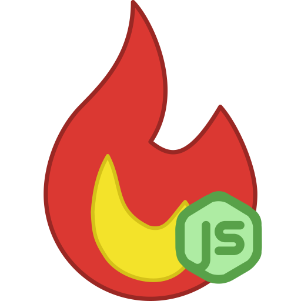

<h1 align="center">
  
  <br>
  La Flamita Admin
  <br>
  <br>
</h1>

<p align="center">
  <a href="https://expressjs.com/"></a>
  <a href="https://react.dev/"></a>
  <a href="https://tailwindcss.com/"></a>
  <a href="https://flowbite.com/"></a>
</p>

> [!NOTE]
> Este es un `submodule` que forma parte del proyecto [`la-flamita`](https://github.com/InterdataUTJ/la-flamita/).

> [!IMPORTANT]
> Este proyecto solo representa el área administrativa. Puedes consultar el área del cliente desde el repositorio [`la-flamita-cliente`](https://github.com/InterdataUTJ/la-flamita-cliente/).

Desarrollo Web área administrativa de [`Express`](https://expressjs.com/) y [`React`](https://react.dev/) para taquería la flamita. La solución se enfoca en desarrollar toda la infraestructura web (vistas y APIs) para la logica de negocios de `la-flamita`.

## Documentación 📕

### Como levantar el entono de desarrollo

1. Primero debes de asegurarte de contar con los requisitos minimos:

  - [`MongoDB`](https://www.mongodb.com/) (_recomendamos cumplir con esta dependencia mediante [`MongoDB Atlas`](https://www.mongodb.com/lp/cloud/atlas/try4)_).
  - [`NodeJS`](https://nodejs.org/en/) minimo versión 18 LTS (_con su respectiva instalación de [`npm`](https://www.npmjs.com/), el cual se incluye por defecto con node_).

2. Clonar el repositorio (_asegurate de tener acceso al repositorio_).

```bash
git clone https://github.com/InterdataUTJ/la-flamita-admin.git
```

3. Navegar al directorio del repositorio

```bash
cd la-flamita-admin/
```

4. Configurar las variables de entorno. 

```bash
cp .env.example .env
```


5. Instalar dependencias.

```bash
npm install
```

6. Arrancar la base de datos.

_Este proceso dependera de la instalación de BD a elegir, es completamente independiente del proyecto. El unico requisito adicional es crear la base de datos con el mismo nombre de las variables de entorno (No es necesario crear tablas manualmente)._

7. Arrancar el servidor

_Estos comandos deben de ejecutarse en terminales diferentes pues bloquean el acceso a esta._

```bash
npm run dev
```

### Modulos del sistema 🧩

- Clientes 🙂
- Empleados 💁‍♂️
- Ventas 💰
- Productos 🌮
- Categorias 📁
- Sensores IoT🔌

### Roles de acceso 👑

1. **Administrador** (_Tiene acceso completo a todos los modulos de la web_)👑
2. **Gerente** (_Tiene acceso completo excepto empleados (no puede borrar) y clientes (donde solo puede ver)_)🦸
3. **Empleado** (_Tiene acceso solo para ver los modulo de productos, categorías y clientes, además de acceso total a ventas, excepto eliminar_)👨‍🍳