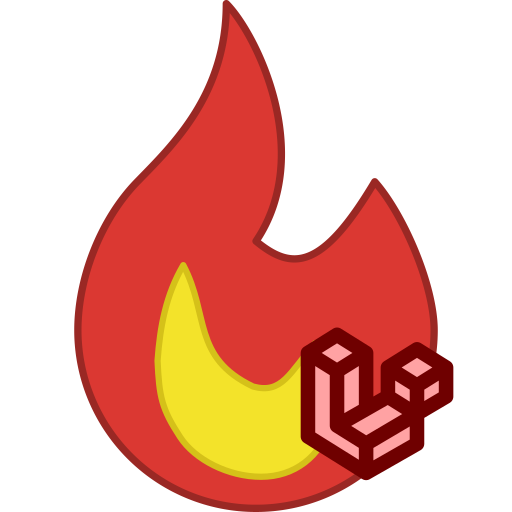

<h1 align="center">
  
   
  La Flamita Web
   
   
</h1>

  
  
  
  

> [!NOTE]
> Este es un `submodule` que forma parte del proyecto [`la-flamita`](https://github.com/InterdataUTJ/la-flamita/).

Desarrollo Web de [`Laravel`](https://laravel.com/docs/10.x) para taquería la flamita. La solución se enfoca en desarrollar toda la infraestructura web (vistas y APIs) para la logica de negocios de `la-flamita`.

## Documentación 📕

### Roles de acceso 👑

1. **Administrador** (_Tiene acceso completo a todos los modulos de la web_)👑
2. **Gerente** (_Tiene acceso completo excepto clientes, donde solo puede ver_)🦸
3. **Empleado** (_Tiene acceso solo para ver los modulo de productos y clientes, y acceso total a ventas, excepto eliminar_)👨‍🍳
4. **Cliente** (_Solo ver peril y hacer compras_)

### Modulos del sistema 🧩

- Clientes 🙂
- Empleados 💁‍♂️
- Ventas 💰
- Productos 🌮
- Categorias 📁
- Carrito 🛒
- Sensores IoT🔌

### Modulo de Empleado

- `GET /empleado/login` 
- `POST /empleado/logout`
-

### Modulo de Cliente

- `GET /cliente/login` 
- `POST /cliente/logout`
- :
### Modulo de Ventas

### Modulo de Producto

### Categoria 

### Carrito

### Sensores de IoT